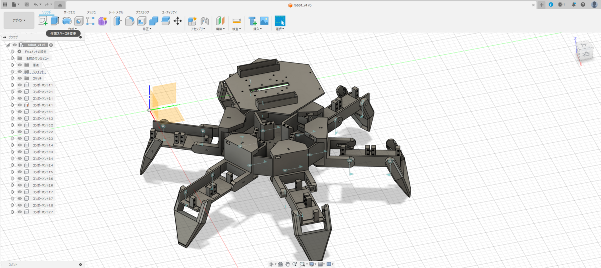

# Tagurobot V1

本リポジトリは6脚ロボットの3Dモデルと制御用ソフトウェアの一部を格納したものになります。
詳細は下記の記事を御覧ください。

- [https://tech-blog.abeja.asia/entry/advent-2023-day08](https://tech-blog.abeja.asia/entry/advent-2023-day08)

# ディレクトリ・ファイル説明

- models
  - STL形式の3Dモデルが格納されています

- main.py
  - PC上、ロボット搭載のRaspberryPi上で動作可能なソフト
  - 制御シミュレーションやサーボモーターの制御が可能
  - 下記ライブラリを利用しています
    - [PyQT5](https://pypi.org/project/PyQt5/)
    - [adafruit_motor](https://github.com/adafruit/Adafruit_CircuitPython_Motor)
    - [adafruit_pca9685](https://github.com/adafruit/Adafruit_CircuitPython_PCA9685)

- gamepad_control.py
  - Gamepadと連動して各関節の駆動テストができます

# 3Dモデル・ソフトウェアの利用ポリシー
今回、知識のある理工学系の学生さんであれば誰でも作れるように、3Dモデルや一部ソフトウェアを公開しています。学習用途であればお気軽に使っていただいて構いません。
一方で、学習用途以外で利用したい方は事前にご相談ください。
相談先＝＞ [@xecus](https://twitter.com/xecus)

- LiPoバッテリーを利用する為、充電時やショートには十分ご注意ください
  - 大電流を流すことができるため、短絡すると非常に危険です
  - 回路を触るときは必ず電源OFFにしましょう
  - 充電時は過充電保護機能が搭載されている充電器を利用しましょう
- サーボモーターのトルクが強いため、指挟み事故等には注意
- 3Dプリンターの可動部・高温部に気をつける
  - FDMの場合、ノズル温度は約200度になります (PLAの場合)
- 工具を利用する場合は、怪我に注意する
  - はんだごて、ニッパー、カッターによる受傷に注意
  - 部品・工具の取り扱い、組み立て、テスト稼働には危険が伴います。作成時及び

作成物に起因した事故は当方では責任は負いかねます。(At your own risk)
